# Healthcare Chatbot API - Complete Integration Guide

## Overview

This document provides complete API specifications, request/response examples, and integration workflows for the Healthcare Chatbot system.

**Key Features:**
- **Patient Chatbot**: AI assistant with safety guardrails (no diagnoses, simplified terminology)
- **Doctor Chatbot**: Full AI access like ChatGPT (detailed medical analysis, no restrictions)
- **Document Upload**: Support for PDF, images, and DICOM files
- **Conversation History**: Track all chat sessions
- **RAG-Based Context**: Answers based on patient's medical documents

---

## Base URL

```
http://localhost:8000/api/v1/chat
```

---

## Patient Chatbot Endpoints

### 1. Patient Chat

**POST** `/patient/{patient_uuid}`

Send a message to the patient chatbot with AI safety guardrails.

**Request:**
```json
{
  "message": "What does my blood test show?",
  "conversation_id": "optional-uuid-for-continuing-conversation"
}
```

**Response (Success):**
```json
{
  "conversation_id": "123e4567-e89b-12d3-a456-426614174000",
  "message": "Based on your recent blood test, I can help you understand the results. Your cholesterol levels show...\n\n---\n\n**Important:** This information is for educational purposes only. Always consult your healthcare provider for medical advice specific to your situation.",
  "sources": ["doc-id-1", "doc-id-2"],
  "is_emergency": false,
  "is_complex": false,
  "guardrails_applied": ["terminology_simplified", "disclaimer_added"]
}
```

**Response (Emergency Detected):**
```json
{
  "conversation_id": "123e4567-e89b-12d3-a456-426614174000",
  "message": "🚨 **URGENT: Seek Immediate Medical Attention**\n\nBased on your message, this may be a medical emergency. Please:\n\n1. **Call emergency services (911/112) immediately**...",
  "sources": [],
  "is_emergency": true,
  "is_complex": false,
  "guardrails_applied": ["emergency_detected"]
}
```

**Response (Complex Query Redirected):**
```json
{
  "conversation_id": "123e4567-e89b-12d3-a456-426614174000",
  "message": "I understand you have important questions about your health. However, questions about diagnosis, treatment decisions, or serious medical conditions require professional medical evaluation.\n\n**I recommend:**\n- 📞 **Schedule an appointment with your doctor**...",
  "sources": [],
  "is_emergency": false,
  "is_complex": true,
  "guardrails_applied": ["complex_query_redirect"]
}
```

---

### 2. Patient Document Upload

**POST** `/patient/{patient_uuid}/upload`

Upload a medical document (PDF, image, DICOM).

**Request (multipart/form-data):**
```
file: <binary file data>
```

**Response:**
```json
{
  "document_id": "doc-123e4567-e89b-12d3-a456-426614174000",
  "patient_uuid": "patient-123e4567-e89b-12d3-a456-426614174000",
  "filename": "blood_test_report.pdf",
  "file_size_bytes": 524288,
  "mime_type": "application/pdf",
  "processing_status": "UPLOADED",
  "message": "Document uploaded successfully. Processing started."
}
```

---

### 3. Patient Conversation History

**GET** `/patient/{patient_uuid}/history`

Get list of all patient conversations.

**Response:**
```json
{
  "conversations": [
    {
      "conversation_id": "conv-123",
      "title": null,
      "message_count": 5,
      "last_message": "Thank you for explaining my test results...",
      "created_at": "2026-02-07T00:30:00Z",
      "updated_at": "2026-02-07T00:45:00Z"
    }
  ],
  "total_count": 1
}
```

---

### 4. Patient Documents List

**GET** `/patient/{patient_uuid}/documents`

Get list of all uploaded documents.

**Response:**
```json
{
  "documents": [
    {
      "document_id": "doc-123",
      "filename": "blood_test_report.pdf",
      "file_size_bytes": 524288,
      "mime_type": "application/pdf",
      "document_type": "LAB_REPORT",
      "processing_status": "COMPLETED",
      "uploaded_at": "2026-02-07T00:30:00Z"
    }
  ],
  "total_count": 1
}
```

---

## Doctor Chatbot Endpoints

### 5. Doctor General Chat

**POST** `/doctor/{doctor_uuid}`

General AI chat for doctors (like ChatGPT, no restrictions).

**Request:**
```json
{
  "message": "Explain the mechanism of action of metformin in type 2 diabetes",
  "conversation_id": "optional-uuid"
}
```

**Response:**
```json
{
  "conversation_id": "conv-456",
  "message": "Metformin is a biguanide antidiabetic agent that works through several mechanisms:\n\n1. **Hepatic Glucose Production**: Metformin primarily reduces hepatic gluconeogenesis by activating AMP-activated protein kinase (AMPK)...\n\n2. **Insulin Sensitivity**: It enhances peripheral glucose uptake in skeletal muscle and adipose tissue...",
  "sources": [],
  "patient_summary": null
}
```

---

### 6. Doctor Patient-Specific Chat

**POST** `/doctor/{doctor_uuid}/patient/{patient_uuid}`

Chat about a specific patient with full medical record access.

**Request:**
```json
{
  "patient_uuid": "patient-123",
  "message": "Analyze this patient's tumor marker trends",
  "conversation_id": "optional-uuid",
  "additional_context": "Patient presented with palpable mass in upper outer quadrant"
}
```

**Response:**
```json
{
  "conversation_id": "conv-789",
  "message": "Based on the available medical records:\n\n**Tumor Marker Analysis:**\n- CA 15-3: 45 U/mL (elevated, reference <30)\n- CA 27-29: 52 U/mL (elevated, reference <38)\n- Trend: Progressive increase over 3 months\n\n**Clinical Significance:**\nThe rising tumor markers combined with the palpable mass suggest active disease progression...",
  "sources": ["doc-id-1", "doc-id-2", "doc-id-3"],
  "patient_summary": {
    "name": "Jane Doe",
    "age": 45,
    "health_score": 47,
    "risk_level": "HIGH"
  }
}
```

---

### 7. Doctor Document Upload

**POST** `/doctor/{doctor_uuid}/upload`

Doctor uploads a document for a patient.

**Request (multipart/form-data):**
```
file: <binary file data>
patient_uuid: "patient-123e4567-e89b-12d3-a456-426614174000"
```

**Response:**
```json
{
  "document_id": "doc-456",
  "patient_uuid": "patient-123",
  "filename": "mammogram_results.jpg",
  "file_size_bytes": 2097152,
  "mime_type": "image/jpeg",
  "processing_status": "UPLOADED",
  "message": "Document uploaded successfully. Processing started."
}
```

---

## Common Endpoints

### 8. Document Processing Status

**GET** `/documents/{document_id}/status`

Check document processing status.

**Response:**
```json
{
  "document_id": "doc-123",
  "processing_status": "COMPLETED",
  "tier_1_complete": true,
  "tier_2_complete": true,
  "tier_3_complete": true,
  "error_message": null,
  "processed_at": "2026-02-07T00:35:00Z"
}
```

**Processing Statuses:**
- `UPLOADED`: Document uploaded, processing not started
- `PROCESSING`: Currently being processed
- `COMPLETED`: All processing tiers complete
- `FAILED`: Processing failed (check `error_message`)

**Processing Tiers:**
- **Tier 1**: OCR/Text extraction
- **Tier 2**: Vision-based analysis (for images)
- **Tier 3**: RAG indexing (semantic search)

---

## Error Responses

### 404 Not Found
```json
{
  "detail": "Patient not found"
}
```

### 422 Validation Error
```json
{
  "detail": [
    {
      "type": "string_too_short",
      "loc": ["body", "message"],
      "msg": "String should have at least 1 character"
    }
  ]
}
```

### 500 Internal Server Error
```json
{
  "detail": "Error in patient chat: <error details>"
}
```

---

## Frontend Integration Workflows

### Workflow 1: Patient Asking About Test Results


### Workflow 2: Patient Emergency Detection

```mermaid
sequenceDiagram
    participant F as Frontend
    participant API as Chat API
    participant Guard as AI Guardrails
    
    F->>API: POST /patient/{uuid}
    Note over F,API: message: "Severe chest pain"
    
    API->>Guard: Check for emergency keywords
    Guard-->>API: Emergency detected!
    
    API-->>F: Urgent response
    Note over F: Display emergency alert:<br/>"🚨 CALL 911 IMMEDIATELY"
    
    F->>F: Show emergency UI
    Note over F: Red banner, call button,<br/>location services
```



### Workflow 3: Doctor Analyzing Patient


### Workflow 4: Document Upload & Processing


---

## Frontend Implementation Examples

### Example 1: Patient Chat Component (React)

```javascript
import { useState } from 'react';

function PatientChat({ patientUuid }) {
  const [message, setMessage] = useState('');
  const [conversation, setConversation] = useState([]);
  const [conversationId, setConversationId] = useState(null);
  
  const sendMessage = async () => {
    const response = await fetch(
      `http://localhost:8000/api/v1/chat/patient/${patientUuid}`,
      {
        method: 'POST',
        headers: { 'Content-Type': 'application/json' },
        body: JSON.stringify({
          message,
          conversation_id: conversationId
        })
      }
    );
    
    const data = await response.json();
    
    // Handle emergency
    if (data.is_emergency) {
      showEmergencyAlert(data.message);
      return;
    }
    
    // Handle complex query redirect
    if (data.is_complex) {
      showDoctorRedirectBanner(data.message);
    }
    
    // Update conversation
    setConversationId(data.conversation_id);
    setConversation([
      ...conversation,
      { role: 'user', content: message },
      { role: 'assistant', content: data.message }
    ]);
    setMessage('');
  };
  
  return (
    <div className="chat-container">
      {conversation.map((msg, i) => (
        <div key={i} className={`message ${msg.role}`}>
          {msg.content}
        </div>
      ))}
      <input
        value={message}
        onChange={(e) => setMessage(e.target.value)}
        placeholder="Ask about your health..."
      />
      <button onClick={sendMessage}>Send</button>
    </div>
  );
}
```

### Example 2: Document Upload Component (React)

```javascript
function DocumentUpload({ patientUuid }) {
  const [uploading, setUploading] = useState(false);
  const [documentId, setDocumentId] = useState(null);
  
  const uploadDocument = async (file) => {
    setUploading(true);
    
    const formData = new FormData();
    formData.append('file', file);
    
    const response = await fetch(
      `http://localhost:8000/api/v1/chat/patient/${patientUuid}/upload`,
      {
        method: 'POST',
        body: formData
      }
    );
    
    const data = await response.json();
    setDocumentId(data.document_id);
    
    // Poll for processing status
    pollDocumentStatus(data.document_id);
  };
  
  const pollDocumentStatus = async (docId) => {
    const interval = setInterval(async () => {
      const response = await fetch(
        `http://localhost:8000/api/v1/chat/documents/${docId}/status`
      );
      const data = await response.json();
      
      if (data.processing_status === 'COMPLETED') {
        clearInterval(interval);
        setUploading(false);
        showSuccess('Document ready! You can now ask questions about it.');
      } else if (data.processing_status === 'FAILED') {
        clearInterval(interval);
        setUploading(false);
        showError(data.error_message);
      }
    }, 5000); // Poll every 5 seconds
  };
  
  return (
    <div>
      <input
        type="file"
        accept=".pdf,.jpg,.jpeg,.png"
        onChange={(e) => uploadDocument(e.target.files[0])}
        disabled={uploading}
      />
      {uploading && <div>Processing document...</div>}
    </div>
  );
}
```

---

## Testing

### Run Patient Tests
```bash
python3 test_patient_chatbot.py
```

### Run Doctor Tests
```bash
python3 test_doctor_chatbot.py
```

---

## Notes for Frontend Developers

1. **Patient Guardrails**: Always check `is_emergency` and `is_complex` flags in responses
2. **Conversation IDs**: Store and reuse `conversation_id` to maintain chat context
3. **Document Processing**: Poll `/documents/{id}/status` every 5 seconds after upload
4. **Error Handling**: Handle 404 (not found), 422 (validation), and 500 (server error)
5. **File Uploads**: Use `multipart/form-data` for document uploads
6. **Emergency UI**: Create prominent emergency alert UI for `is_emergency: true` responses
7. **Source Documents**: Display `sources` array to show which documents were used
8. **Patient Summary**: For doctor views, display `patient_summary` alongside chat

---

## Rate Limiting & Performance

- **Chat Endpoints**: No rate limit (production should add)
- **Document Upload**: Max 50MB per file
- **Supported Formats**: PDF, JPG, PNG, DICOM
- **Processing Time**: 10-30 seconds depending on file size
- **RAG Context**: Patient gets 5 chunks, Doctor gets 10 chunks

---

## Security Considerations

1. **Authentication**: Add JWT token validation (not implemented yet)
2. **Authorization**: Verify patient/doctor access to resources
3. **Data Privacy**: All patient data is HIPAA-compliant
4. **File Validation**: Only allow medical document formats
5. **Input Sanitization**: All inputs are validated via Pydantic schemas
